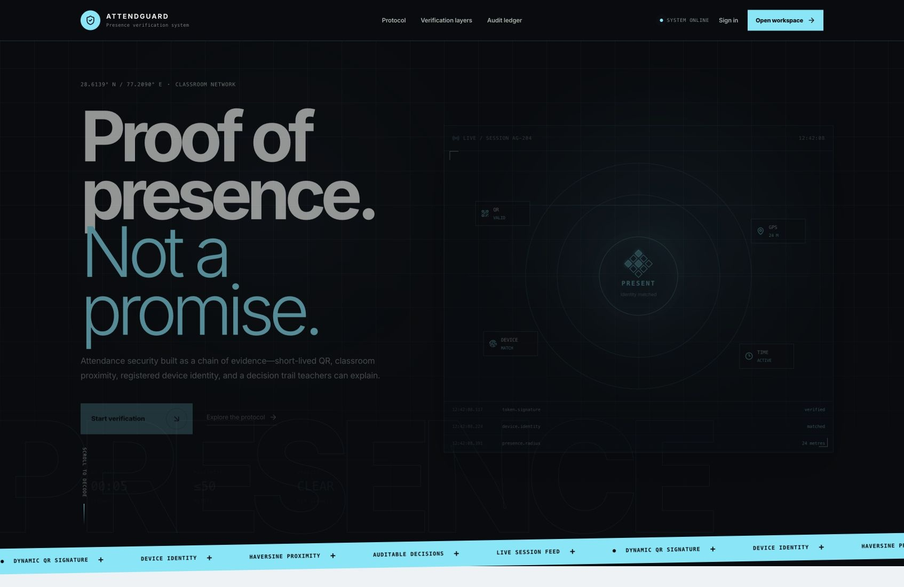
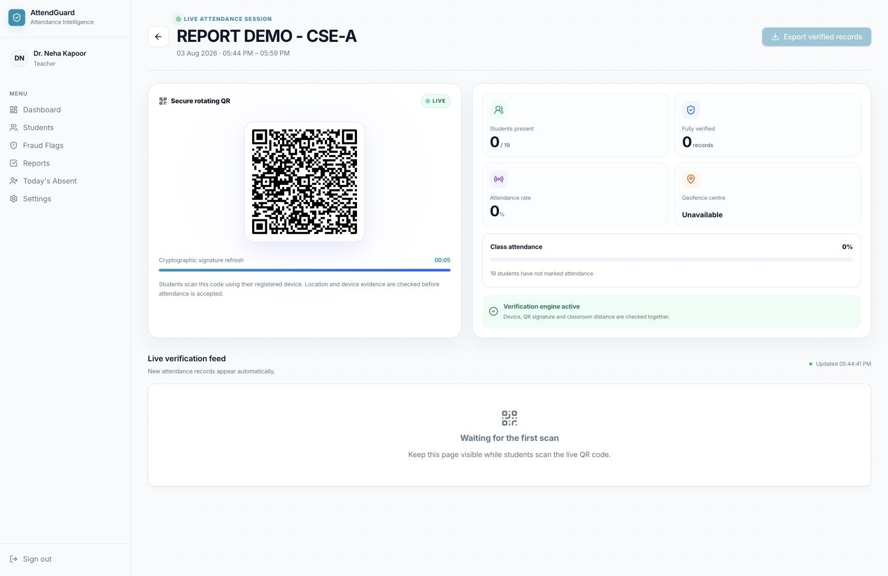
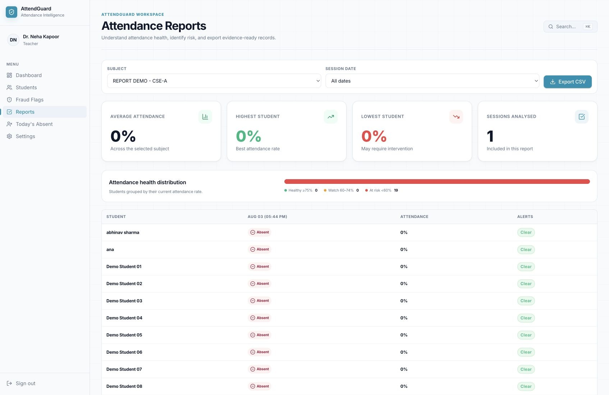
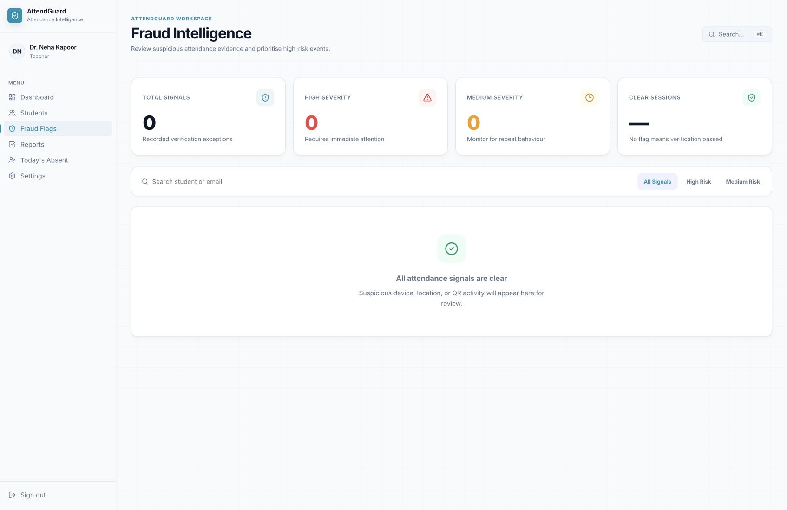

<div align="center">
  
</div>

<br />

<div align="center">
  <a href="https://github.com/abhinav20january-a11y?tab=repositories"></a>
  <a href="https://leetcode.com/u/abhinavjan20/"></a>
  
</div>

<div align="center">
  <h3>Building reliable products where interface, API, data, and security work as one system.</h3>
  <sub>Full-stack engineering · secure workflows · relational data · human-centred product design</sub>
</div>

---

## `01` Flagship project — AttendGuard

### Fraud-resistant attendance, designed as a verification system

AttendGuard is a responsive full-stack attendance prototype built during my internship at **Promatics Technologies Pvt. Ltd.** It addresses a simple but important problem: possessing a QR image should not be enough to prove classroom presence.

Instead of trusting every scan, AttendGuard evaluates a chain of signals before creating an attendance record.

<div align="center">
  
</div>

<br />

<div align="center">
  
</div>

### What the system does

<table>
  <tr>
    <td width="50%"><b>Teacher command centre</b><br/><sub>Create controlled attendance sessions, monitor live participation, review absentees, inspect rejected attempts, and generate class reports.</sub></td>
    <td width="50%"><b>Student attendance journey</b><br/><sub>Sign in, scan the current session QR, share browser-provided context, receive clear validation feedback, and review attendance history.</sub></td>
  </tr>
  <tr>
    <td><b>Multi-signal verification</b><br/><sub>Checks JWT identity, role, session status, QR freshness and signature, geolocation radius, device context, and duplicate attendance.</sub></td>
    <td><b>Auditable risk handling</b><br/><sub>Accepted records and suspicious or rejected attempts are separated so teachers can review what happened and why.</sub></td>
  </tr>
  <tr>
    <td><b>Reporting and insights</b><br/><sub>Attendance percentages, report matrices, absentees, subject history, dashboard totals, and correction-request foundations.</sub></td>
    <td><b>Notification prototype</b><br/><sub>Absence-condition checks and email-preview testing through Nodemailer and Ethereal.</sub></td>
  </tr>
</table>

### Product evidence

<table>
  <tr>
    <td width="50%"><br/><sub><b>Product entry:</b> a focused explanation of proof-of-presence rather than a generic digital register.</sub></td>
    <td width="50%"><br/><sub><b>Live session:</b> a time-controlled QR workflow with real-time teacher visibility.</sub></td>
  </tr>
  <tr>
    <td><br/><sub><b>Reporting:</b> class-level attendance distribution, status matrix, and export-oriented views.</sub></td>
    <td><br/><sub><b>Fraud intelligence:</b> rejected and suspicious attempts remain visible instead of disappearing.</sub></td>
  </tr>
</table>

### Engineering decisions

```text
React + Vite client
        │ authenticated REST requests
        ▼
Node.js + Express API ── JWT roles ── validation pipeline
        │
        ├── signed, short-lived QR checks
        ├── Haversine distance validation
        ├── browser/device context checks
        ├── duplicate-attempt prevention
        └── accepted record or reasoned fraud event
        │
        ▼
MySQL relational model + reports + audit history
```

<details>
  <summary><b>Open the project architecture</b></summary>
  <br/>

- **Authentication module:** registration, bcrypt password hashing, JWT issuance, protected endpoints, and role checks.
- **Teacher workspace:** session creation, dynamic QR display, live counts, reports, absentees, and flagged attempts.
- **Student workspace:** QR scanning, subject progress, attendance history, percentages, and request history.
- **Attendance service:** time-window checks, token validation, distance calculation, duplicate prevention, and record creation.
- **Risk engine:** QR age/signature, location, device, and suspicious-attempt logging.
- **Reporting service:** matrices, percentages, absence lists, and dashboard aggregates.
- **Profile and notification foundations:** Multer uploads plus Nodemailer/Ethereal email-preview testing.

</details>

<details>
  <summary><b>What I learned building it</b></summary>
  <br/>

- A digital form is easy; deciding whether its claim is trustworthy is the real engineering problem.
- Security checks belong on the server—client-side UI state is never an authorization boundary.
- One feature can span the React screen, Express route, relational schema, test scenarios, and documentation.
- Fraud signals are imperfect individually, so the system combines them and records explainable failure reasons.
- Prototype limits matter: indoor GPS drift, changing browser fingerprints, network dependence, and untested production load are documented rather than hidden.

</details>

## `02` Technology constellation

<div align="center">
  
</div>

<br />

| Layer | Tools and concepts |
|---|---|
| Product interface | React, Vite, responsive layouts, teacher/student experiences, accessible feedback |
| API and identity | Node.js, Express, REST, JWT, bcrypt, role-based authorization |
| Verification | Signed QR payloads, token freshness, Haversine distance, device context, duplicate checks |
| Data | MySQL, relational modelling, foreign keys, audit history, reporting queries |
| Delivery | Git, GitHub, functional positive/negative testing, architecture and API documentation |

## `03` Developer telemetry

<div align="center">
  <picture>
    <source media="(prefers-color-scheme: dark)" srcset="https://github-readme-stats.vercel.app/api?username=abhinav20january-a11y&show_icons=true&hide_border=true&bg_color=040B17&title_color=38BDF8&icon_color=34D399&text_color=C7D2E8&rank_icon=github" />
    
  </picture>
  <picture>
    <source media="(prefers-color-scheme: dark)" srcset="https://github-readme-streak-stats.herokuapp.com?user=abhinav20january-a11y&hide_border=true&background=040B17&ring=0EA5E9&fire=34D399&currStreakLabel=67E8F9&sideLabels=AAB8D6&dates=667795&currStreakNum=F8FAFF&sideNums=F8FAFF" />
    
  </picture>
</div>

## `04` Contribution signal

<div align="center">
  <picture>
    <source media="(prefers-color-scheme: dark)" srcset="https://raw.githubusercontent.com/abhinav20january-a11y/abhinav20january-a11y/output/github-contribution-grid-snake-dark.svg" />
    <source media="(prefers-color-scheme: light)" srcset="https://raw.githubusercontent.com/abhinav20january-a11y/abhinav20january-a11y/output/github-contribution-grid-snake.svg" />
    
  </picture>
</div>

## `05` Engineering principles

> Do not merely record the action. Verify the context, preserve the evidence, and make the result explainable.

- Design failure states as carefully as successful ones.
- Keep authorization and trust decisions on the server.
- Connect interface choices to API rules and relational data.
- Prefer honest prototypes with documented limits over inflated claims.
- Build software that feels clear to the user and inspectable to the engineer.

<div align="center">
  <sub>Designed and engineered by <b>Abhinav Sharma</b> · Learning in public, building with intent.</sub>
</div>
