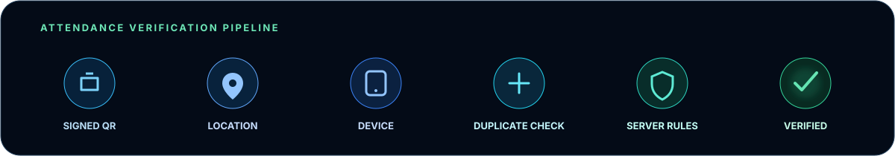

<div align="center">
  
</div>

<br />

<div align="center">
  <a href="https://github.com/abhinav20january-a11y?tab=repositories"></a>
  <a href="https://leetcode.com/u/abhinavjan20/"></a>
  
</div>

## `01` Currently building

### AlgoFlow — an interview-preparation operating system

AlgoFlow connects problem solving, C++ execution, spaced repetition and learning analytics inside one focused desktop workspace.

```text
Accepted submission
       ↓
Topic classification → Saved solution → Recall schedule → GitHub vault
       ↓
Pattern mastery + interview readiness
```

<table>
  <tr>
    <td width="50%"><b>Practice intelligence</b><br/><sub>LeetCode and GeeksforGeeks capture, duplicate detection, company signals and topic routing.</sub></td>
    <td width="50%"><b>Professional coding studio</b><br/><sub>C++20 execution, test-case management, recall mode, notes and complexity analysis.</sub></td>
  </tr>
  <tr>
    <td><b>Retention system</b><br/><sub>Spaced-repetition queues, revision reasons, important problems and progress history.</sub></td>
    <td><b>Developer workflow</b><br/><sub>GitHub solution publishing, backup and restore, desktop packaging and cross-platform foundations.</sub></td>
  </tr>
</table>

<div align="center"></div>

## `02` Engineering stack

<div align="center">
  
</div>

<br />

| Layer | Tools and concepts |
|---|---|
| Interface | React 19, responsive design systems, Framer Motion, CodeMirror |
| Desktop | Electron, macOS and Windows packaging, native C++ toolchains |
| Data | Firebase, offline-first persistence, backup and reconciliation |
| Engineering | C++20, DSA, complexity analysis, testing, CI workflows |

## `03` Developer telemetry

<div align="center">
  <picture>
    <source media="(prefers-color-scheme: dark)" srcset="https://github-readme-stats.vercel.app/api?username=abhinav20january-a11y&show_icons=true&hide_border=true&bg_color=070B18&title_color=8B9CFF&icon_color=38BDF8&text_color=C7D2E8&rank_icon=github" />
    
  </picture>
  <picture>
    <source media="(prefers-color-scheme: dark)" srcset="https://github-readme-streak-stats.herokuapp.com?user=abhinav20january-a11y&hide_border=true&background=070B18&ring=7C5CFF&fire=38BDF8&currStreakLabel=A78BFA&sideLabels=AAB8D6&dates=667795&currStreakNum=F8FAFF&sideNums=F8FAFF" />
    
  </picture>
</div>

## `04` Contribution signal

<div align="center">
  <picture>
    <source media="(prefers-color-scheme: dark)" srcset="https://raw.githubusercontent.com/abhinav20january-a11y/abhinav20january-a11y/output/github-contribution-grid-snake-dark.svg" />
    <source media="(prefers-color-scheme: light)" srcset="https://raw.githubusercontent.com/abhinav20january-a11y/abhinav20january-a11y/output/github-contribution-grid-snake.svg" />
    
  </picture>
</div>

## `05` What I care about

> Build clear systems. Understand the pattern. Verify the edge cases. Make the next attempt better than the last.

- Designing tools that make deliberate practice easier
- Writing understandable solutions before clever ones
- Connecting algorithms to real engineering decisions
- Building products that feel calm, fast and intentional

<div align="center">
  <sub>Designed and engineered by <b>Abhinav Sharma</b> · Always learning, always shipping.</sub>
</div>
